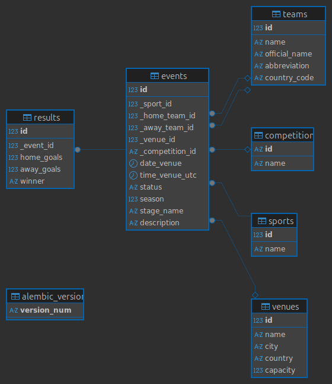

# Sportradar Sports Event Calendar

## Overview

A sports event calendar web application built for the Sportradar Coding Academy exercise.
It stores and displays sports events such as "Salzburg vs Sturm - Football, 18.07.2019 18:30"
with full CRUD support via a REST API and a simple HTML frontend.

The application allows users to:
- View sports events in a table
- Filter events by sport or date
- Add new events via a form
- Retrieve events via a REST API

---

## Tech Stack

| Layer      | Technology                        |
|------------|-----------------------------------|
| Backend    | Python 3.13, FastAPI, SQLAlchemy  |
| Database   | PostgreSQL 16                     |
| Migrations | Alembic                           |
| Frontend   | HTML, CSS, JavaScript             |
| Packaging  | uv                                |
| Linting    | Ruff                              |
| Testing    | pytest, httpx                     |
| CI         | GitHub Actions                    |

---

## Database Design

The schema follows **Third Normal Form (3NF)** with 6 tables:




See the full ERD in [docs/erd.md](docs/erd.md).

---

## API Endpoints

| Method | Endpoint           | Description                        |
|--------|--------------------|------------------------------------|
| GET    | `/events/`         | List all events (supports filters) |
| GET    | `/events/?sport=Football` | Filter by sport name        |
| GET    | `/events/?date=2024-07-18` | Filter by date             |
| GET    | `/events/{id}`     | Get a single event by ID           |
| POST   | `/events/`         | Create a new event                 |

### POST `/events/` — Request body

```json
{
  "date_venue": "2024-07-18",
  "time_venue_utc": "18:30:00",
  "sport_name": "Football",
  "home_team_name": "Salzburg",
  "away_team_name": "Sturm",
  "status": "scheduled",
  "description": "Optional description"
}
```

Sport and team records are created automatically if they don't exist yet.

---

## Project Structure

```
sportradar-calendar/
├── app/
│   ├── main.py          # FastAPI app, CORS, static files
│   ├── models.py        # SQLAlchemy ORM models
│   ├── schemas.py       # Pydantic request/response schemas
│   ├── database.py      # DB engine & session
│   ├── seed.py          # Sample data seeding
│   └── routers/
│       └── events.py    # API endpoints
├── frontend/
│   ├── index.html
│   ├── style.css
│   └── script.js
├── tests/
│   └── test_events.py
├── alembic/             # Database migrations
├── docs/
│   └── erd.md           # Entity-Relationship Diagram (DBeaver)
├── .env.example
├── docker-compose.yml
└── Dockerfile
```

## Assumptions & Decisions

- **Sport/team auto-creation** - `POST /events/` uses a "get or create" pattern so callers don't need to manage related entities separately.
- **No duplicate sports** - if two events share the same sport name, they reference the same row.
- **Results are optional** - the `results` table is separate so scheduled events are fully supported.
- **Frontend served by FastAPI** - the `frontend/` directory is mounted as static files at `/frontend`, eliminating the need for a separate web server.
- **Sort order** - events are returned newest-first (descending by date, then time).
- **Efficient data retrieval** - all event relationships (sport, teams, venue, result) are loaded in a single SQL JOIN via SQLAlchemy `joinedload`, avoiding N+1 queries. The entire events list is fetched in one query regardless of how many events exist.
- **3NF normalization** - each entity (sport, team, venue, competition, result) lives in its own table with no repeating groups or transitive dependencies. FK columns use an underscore prefix (`_sport_id`, `_home_team_id`) per task requirements.

## Setup & Running

### Prerequisites

- [Docker](https://docs.docker.com/get-docker/) and Docker Compose

### 1. Clone the repository

```bash
git clone <repo-url>
cd sportradar-calendar
```

### 2. Configure environment

```bash
cp .env.example .env
```

The default `.env` values work out of the box with Docker Compose.

### 3. Start the application

```bash
docker compose up --build
```

This starts:
- **PostgreSQL** on port `5433`
- **FastAPI** on port `8000`

### 4. Apply database migrations

In a separate terminal (while containers are running):

```bash
docker compose exec app uv run alembic upgrade head
```

### 5. (Optional) Seed sample data

```bash
docker compose exec app uv run python -c "from app.seed import seed_sample_events; from app.database import SessionLocal; seed_sample_events(SessionLocal())"
```

### 6. Open the app

- **Frontend:** [http://localhost:8000/frontend/index.html](http://localhost:8000/frontend/index.html)
- **API docs:** [http://localhost:8000/docs](http://localhost:8000/docs)

---

## Running Tests

Tests use an in-memory SQLite database — no running PostgreSQL required.

```bash
uv run pytest tests/test_events.py -v
```

---

