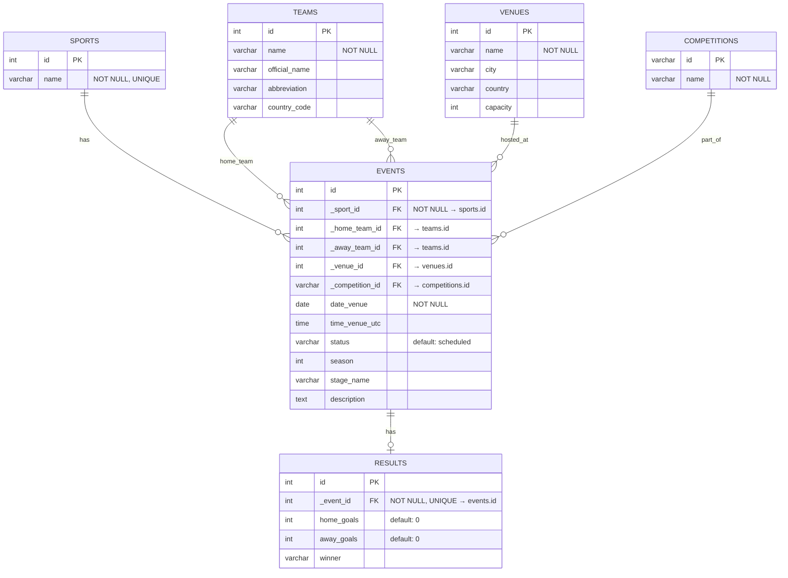

# Entity Relationship Diagram

## Sports Event Calendar — Database Schema

## Design Decisions

- **3NF normalization** - no repeating groups or transitive dependencies; each entity is in its own table.
- **Teams dual FK** - `events` holds two separate FKs (`_home_team_id`, `_away_team_id`) referencing `teams`, avoiding a junction table for a fixed two-team match structure.
- **Competition ID as varchar** - matches external API identifiers (e.g. `sr:competition:17`) rather than auto-increment integers.
- **Results as 1-to-1** - a separate `results` table with a `UNIQUE` FK keeps the events table clean and allows events without results (scheduled/upcoming).
- **FK naming convention** - underscore-prefixed FK columns (`_sport_id`) distinguish FK fields from regular data fields at a glance.
